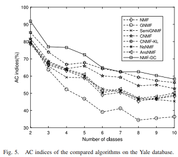
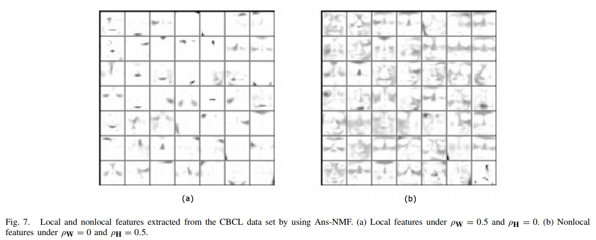
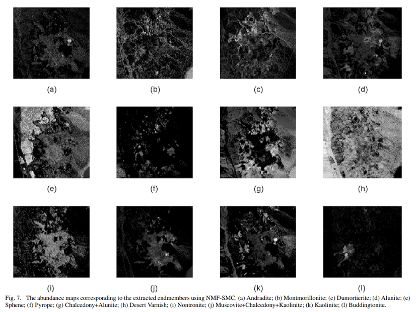

<ol>

  <li><b> Q & A systems 
  
  <li><b> Adaptive method for nonsmooth nonnegative matrix factorization  
  
  <li><b> Blind spectral unmixing based on sparse nonnegative matrix factorization 
  
  <li><b> Manifold optimization-based analysis dictionary learning with an L1/2-norm regularizer  
  
    

