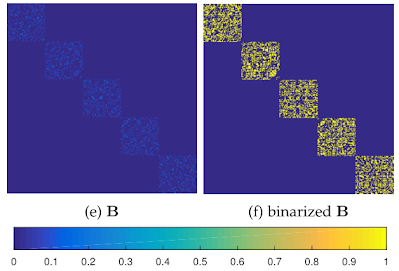
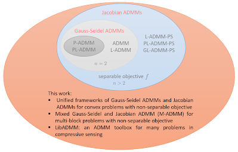
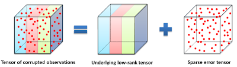

<ol>
  <li><b> Unified Theory of Block Diagonal Matrix Learning for Subspace Clustering 

  
  
  <li><b> Unified Convergence Analysis of Alternating Direction Method of Multipliers (ADMM)  
  
  
  
  <li><b> Tensor Robust Principal Component Analysis (TRPCA)/Tensor Completion/Tensor Recovery 
  
  
  
  <li><b> Generalized Nonconvex Nonsmooth Low-rank Minimization 
  
  

