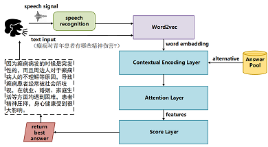
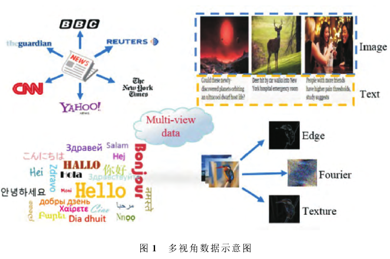
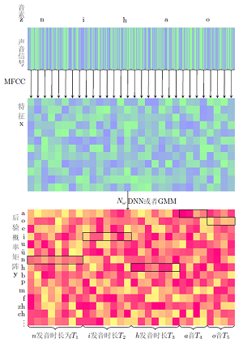
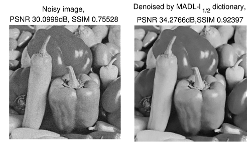

<ol>

  <li><b> Q&A systems for epilepsy diagnostic 
  
  <li><b> Multi-view learning using NMF 
  
  <li><b> Voiceprint recognition by BSS 
  
  <!--<li><b> Manifold optimization-based analysis dictionary learning with an L1/2-norm regularizer  
  -->
    

