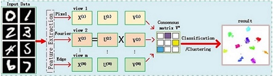

<ol>

  <li><b> Q&A system for epilepsy diagnostic 
   
  
   
  <li><b> Multi-view learning using NMF 
   
  
   
  <li><b> Voiceprint recognition by BSS 
   
  
  <!--<li><b> Manifold optimization-based analysis dictionary learning with an L1/2-norm regularizer  
  -->
    

